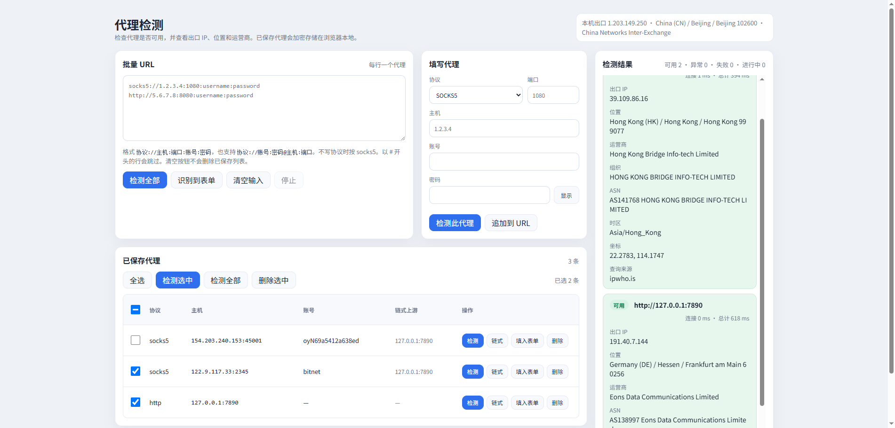

# 代理检测

本地运行的 Web 工具：批量或单条检测 SOCKS/HTTP 代理是否可用，并查看出口 IP、地理位置、运营商与延迟。已保存的代理密码在浏览器内用 AES-GCM 加密，仅存在本机。



## 功能

- **本机出口**：页面右上角显示当前网络（不经过代理）的出口 IP 与归属信息
- **批量检测**：文本框每行一条代理 URL，支持「检测全部」「识别到表单」「停止」
- **表单检测**：协议、主机、端口、账号、密码；可「追加到 URL」或单独检测
- **结果面板**：可用 / 异常 / 失败 / 进行中统计；每条结果含出口 IP、位置、ISP、ASN、时区、坐标、连接耗时等
- **已保存代理**：检测或追加后自动入库；支持全选、检测选中/全部、删除选中
- **链式上游**：为某条代理配置多级上游（本机 → 上游链 → 当前代理 → 目标），最多 8 跳（含出口）
- **协议**：`socks5`、`socks4`、`http`、`https`

## 环境要求

- [Node.js](https://nodejs.org/)（使用内置模块，无需 `npm install`）

## 快速开始

```bash
npm start
```

浏览器打开：**http://127.0.0.1:3002/**

默认只监听 `127.0.0.1`，代理检测请求由本地 Node 服务发起，不会把完整代理列表上传到第三方网站（出口信息查询会访问配置的 IP 查询 API）。

## 代理 URL 格式

每行一条，以 `#` 开头的行会忽略。

| 格式 | 示例 |
|------|------|
| 自定义（推荐） | `socks5://主机:端口:账号:密码` |
| 标准 | `http://账号:密码@主机:端口` |
| 省略协议 | `1.2.3.4:1080:用户:密码`（按 **socks5** 解析） |

## HTTP API

| 方法 | 路径 | 说明 |
|------|------|------|
| `GET` | `/api/direct` | 查询本机直连出口信息 |
| `POST` | `/api/check` | 通过指定代理检测出口（请求体为 JSON，含代理与可选链式配置） |

静态页面：`/`、`/app.js`、`/store.js`、`/style.css`。

## 项目结构

```
agent-test/
├── server.js       # HTTP 服务、代理连接与 IP 查询
├── public/         # 前端页面与逻辑
│   ├── index.html
│   ├── app.js
│   ├── store.js    # 本地保存与密码加密
│   └── style.css
└── static/
    └── image.png   # 界面截图
```

## 许可证

见仓库内 [LICENSE](LICENSE) 文件。
